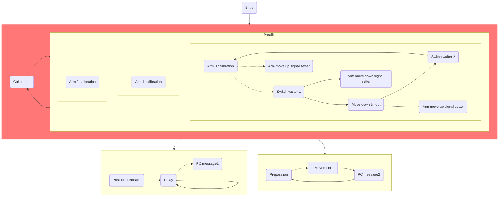
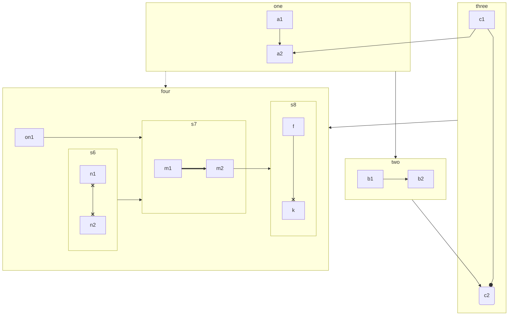

# Mermaid

```mermaid

flowchart TD;
    entry(Entry)
    subgraph cycle1[ ]
        body1(Position feedback)
        delay1(Delay)
        pc_msg1(PC message1)
       
    end
    subgraph waiter1[ ]
        body6(Preparation)
        pc_msg2(PC message2)
        Movement
    end
    subgraph calibration[ ]
        body2(Calibration)

        subgraph parallel1[Parallel]
            subgraph arm0calibration[ ]
                body3(Arm 0 calibration)
                switchwaiter1(Switch waiter 1)
                signalSetter1(Arm move up signal setter)
               
                delay2(Move down timout)
                signalSetter2(Arm move down signal setter)

                signalSetter3(Arm move up signal setter)
                switchwaiter2(Switch waiter 2)
               
            end
            subgraph arm1calibration[ ]
                body4(Arm 1 calibration)
            end
            subgraph arm2calibration[ ]
                body5(Arm 2 calibration)
            end
        end
    end
    style calibration fill:#F77,stroke:#F00,stroke-width:2px
    entry-->calibration 

    body1 -.-> delay1
    delay1 -.-> pc_msg1
    delay1 --> delay1


    body6 -.-> Movement
    Movement --> pc_msg2
    pc_msg2 --x body6

    body2 o-.-> parallel1
    
    body3-.->switchwaiter1
    body3-.->signalSetter1
    switchwaiter1 --> delay2
    switchwaiter1 --> signalSetter2
    delay2 --> switchwaiter2
    delay2 --> signalSetter3
    switchwaiter2 --x body3
    calibration --> cycle1
    calibration --> waiter1

    parallel1 --x body2 

```
---

```mermaid

graph TD;
    A-->B;
    A-->C;
    B-->D;
    C-->D;

```
---

```mermaid

flowchart TB
    linkStyle default interpolate linear
    c1-->a2
    subgraph one
        a1-->a2
    end
    subgraph two
        b1-->b2
    end
    subgraph three
        c1 --o c2(c2)
        click c2 callback "Tooltip for a callback"
    end
    subgraph four
        
        subgraph s7
            m1==>m2
            
        end
       
        
        subgraph s8
           f
           k
           f <--x k
        end
        subgraph s6
            n1 x--x n2
        end
        on1
        on1 ---> s7
        s6 --> s7
        

        m2 --> s8
    end
    one --> two
    three --> four
    two --> c2
    one -.-> four
```
---
